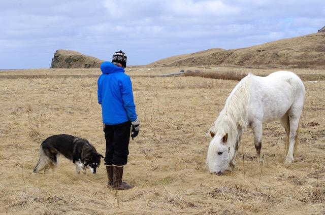

# Object Detection

Leverage existing tensor flow pre-trained models to detect objects in images and videos

## Instruction

* Download the pretrained models from the [model zoo](https://github.com/tensorflow/models/blob/master/research/object_detection/g3doc/detection_model_zoo.md).
* Make sure the update the model file path in [object_detection.py](https://github.com/garygangwu/object_detection_lab/blob/master/object_detection.py)

## Usage

Run `python object_detection.py --help` for available options

example: 
* `python object_detection.py --type image --image_file examples/dog.jpg`
* `python object_detection.py --type video --video_file examples/driving.mp4`

## Examples of results

### SSD (Single Shot MultiBox Detection) based on MobileNet
|Original Image|Result|
|:---:|:---:|
|||

### R-FCN based on ResNet-101
|Original Image|Result|
|:---:|:---:|
|||

### Faster R-CNN based on Inception-ResNet-v2
|Original Image|Result|
|:---:|:---:|
|||
|||
